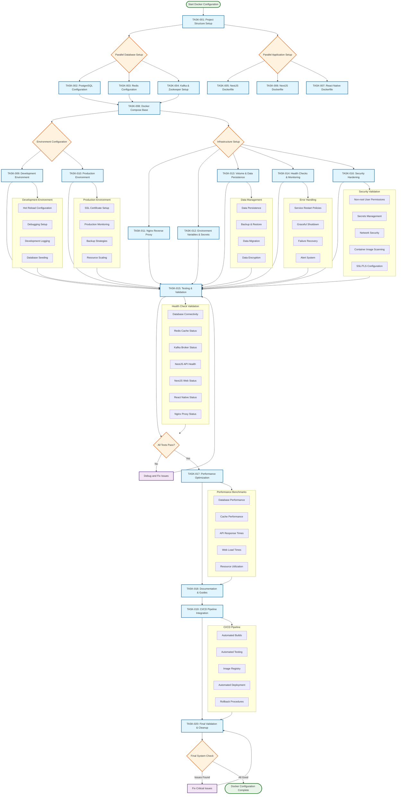

# Docker Configuration Feature - Flowchart Diagram

```mermaid
flowchart TD
    Start([Start Docker Configuration]) --> Setup[TASK-001: Project Structure Setup]
    
    Setup --> ParallelDB{Parallel Database Setup}
    ParallelDB --> PG[TASK-002: PostgreSQL Configuration]
    ParallelDB --> Redis[TASK-003: Redis Configuration]
    ParallelDB --> Kafka[TASK-004: Kafka & Zookeeper Setup]
    
    Setup --> ParallelApp{Parallel Application Setup}
    ParallelApp --> NestJS[TASK-005: NestJS Dockerfile]
    ParallelApp --> NextJS[TASK-006: NextJS Dockerfile]
    ParallelApp --> RN[TASK-007: React Native Dockerfile]
    
    PG --> ComposeBase[TASK-008: Docker Compose Base]
    Redis --> ComposeBase
    Kafka --> ComposeBase
    
    ComposeBase --> EnvConfig{Environment Configuration}
    EnvConfig --> DevEnv[TASK-009: Development Environment]
    EnvConfig --> ProdEnv[TASK-010: Production Environment]
    
    ComposeBase --> Infrastructure{Infrastructure Setup}
    Infrastructure --> Nginx[TASK-011: Nginx Reverse Proxy]
    Infrastructure --> EnvVars[TASK-012: Environment Variables & Secrets]
    Infrastructure --> Volumes[TASK-013: Volume & Data Persistence]
    Infrastructure --> Health[TASK-014: Health Checks & Monitoring]
    Infrastructure --> Security[TASK-016: Security Hardening]
    
    DevEnv --> TestSetup[TASK-015: Testing & Validation]
    ProdEnv --> TestSetup
    Nginx --> TestSetup
    EnvVars --> TestSetup
    Volumes --> TestSetup
    Health --> TestSetup
    Security --> TestSetup
    
    TestSetup --> ValidationCheck{All Tests Pass?}
    ValidationCheck -->|No| Debug[Debug and Fix Issues]
    Debug --> TestSetup
    ValidationCheck -->|Yes| Optimization[TASK-017: Performance Optimization]
    
    Optimization --> Documentation[TASK-018: Documentation & Guides]
    Documentation --> CICD[TASK-019: CI/CD Pipeline Integration]
    
    CICD --> FinalValidation[TASK-020: Final Validation & Cleanup]
    
    FinalValidation --> FinalCheck{Final System Check}
    FinalCheck -->|Issues Found| FixIssues[Fix Critical Issues]
    FixIssues --> FinalValidation
    FinalCheck -->|All Good| Complete([Docker Configuration Complete])
    
    %% Service Health Checks
    subgraph HealthChecks ["Health Check Validation"]
        DBHealth[Database Connectivity]
        CacheHealth[Redis Cache Status]
        BrokerHealth[Kafka Broker Status]
        APIHealth[NestJS API Health]
        WebHealth[NextJS Web Status]
        MobileHealth[React Native Status]
        ProxyHealth[Nginx Proxy Status]
    end
    
    TestSetup --> HealthChecks
    HealthChecks --> ValidationCheck
    
    %% Security Validation
    subgraph SecurityChecks ["Security Validation"]
        UserPerms[Non-root User Permissions]
        SecretsMgmt[Secrets Management]
        NetworkSec[Network Security]
        ImageScan[Container Image Scanning]
        SSLConfig[SSL/TLS Configuration]
    end
    
    Security --> SecurityChecks
    SecurityChecks --> TestSetup
    
    %% Performance Benchmarks
    subgraph PerfBench ["Performance Benchmarks"]
        DBPerf[Database Performance]
        CachePerf[Cache Performance]
        APIPerf[API Response Times]
        WebPerf[Web Load Times]
        ResourceUsage[Resource Utilization]
    end
    
    Optimization --> PerfBench
    PerfBench --> Documentation
    
    %% Environment-Specific Flows
    subgraph DevFlow ["Development Environment"]
        DevHotReload[Hot Reload Configuration]
        DevDebugging[Debugging Setup]
        DevLogging[Development Logging]
        DevSeeding[Database Seeding]
    end
    
    DevEnv --> DevFlow
    DevFlow --> TestSetup
    
    subgraph ProdFlow ["Production Environment"]
        ProdSSL[SSL Certificate Setup]
        ProdMonitoring[Production Monitoring]
        ProdBackup[Backup Strategies]
        ProdScaling[Resource Scaling]
    end
    
    ProdEnv --> ProdFlow
    ProdFlow --> TestSetup
    
    %% CI/CD Pipeline
    subgraph CICDFlow ["CI/CD Pipeline"]
        AutoBuild[Automated Builds]
        AutoTest[Automated Testing]
        ImageRegistry[Image Registry]
        AutoDeploy[Automated Deployment]
        Rollback[Rollback Procedures]
    end
    
    CICD --> CICDFlow
    CICDFlow --> FinalValidation
    
    %% Error Handling
    subgraph ErrorHandling ["Error Handling"]
        ServiceRestart[Service Restart Policies]
        GracefulShutdown[Graceful Shutdown]
        FailureRecovery[Failure Recovery]
        AlertSystem[Alert System]
    end
    
    Health --> ErrorHandling
    ErrorHandling --> TestSetup
    
    %% Data Management
    subgraph DataMgmt ["Data Management"]
        DataPersistence[Data Persistence]
        BackupRestore[Backup & Restore]
        DataMigration[Data Migration]
        DataEncryption[Data Encryption]
    end
    
    Volumes --> DataMgmt
    DataMgmt --> TestSetup
    
    %% Styling
    classDef taskBox fill:#e1f5fe,stroke:#01579b,stroke-width:2px
    classDef decisionBox fill:#fff3e0,stroke:#e65100,stroke-width:2px
    classDef processBox fill:#f3e5f5,stroke:#4a148c,stroke-width:2px
    classDef startEndBox fill:#e8f5e8,stroke:#2e7d32,stroke-width:3px
    
    class Setup,PG,Redis,Kafka,NestJS,NextJS,RN,ComposeBase,DevEnv,ProdEnv,Nginx,EnvVars,Volumes,Health,Security,TestSetup,Optimization,Documentation,CICD,FinalValidation taskBox
    class ParallelDB,ParallelApp,EnvConfig,Infrastructure,ValidationCheck,FinalCheck decisionBox
    class Debug,FixIssues processBox
    class Start,Complete startEndBox
```