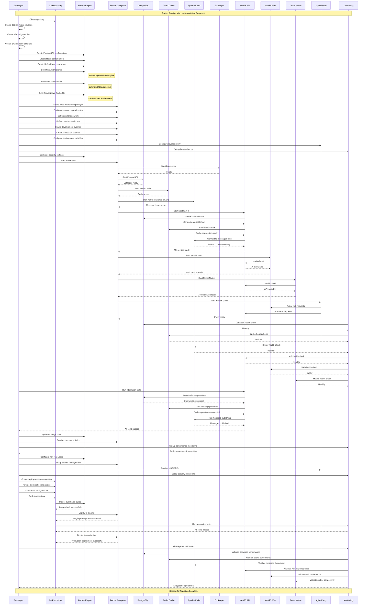

# Docker Configuration Feature - Sequence Diagram

```mermaid
sequenceDiagram
    participant Dev as Developer
    participant Git as Git Repository
    participant Docker as Docker Engine
    participant Compose as Docker Compose
    participant PG as PostgreSQL
    participant Redis as Redis Cache
    participant Kafka as Apache Kafka
    participant ZK as Zookeeper
    participant API as NestJS API
    participant Web as NextJS Web
    participant Mobile as React Native
    participant Nginx as Nginx Proxy
    participant Monitor as Monitoring

    Note over Dev,Monitor: Docker Configuration Implementation Sequence

    %% Phase 1: Project Setup
    Dev->>Git: Clone repository
    Dev->>Dev: Create docker/ folder structure
    Dev->>Dev: Create .dockerignore files
    Dev->>Dev: Create environment templates
    
    %% Phase 2: Database Services Setup
    Dev->>Docker: Create PostgreSQL configuration
    Dev->>Docker: Create Redis configuration
    Dev->>Docker: Create Kafka/Zookeeper setup
    
    %% Phase 3: Application Dockerfiles
    Dev->>Docker: Build NestJS Dockerfile
    Note right of Docker: Multi-stage build with Alpine
    Dev->>Docker: Build NextJS Dockerfile
    Note right of Docker: Optimized for production
    Dev->>Docker: Build React Native Dockerfile
    Note right of Docker: Development environment
    
    %% Phase 4: Docker Compose Configuration
    Dev->>Compose: Create base docker-compose.yml
    Dev->>Compose: Configure service dependencies
    Dev->>Compose: Set up custom network
    Dev->>Compose: Define persistent volumes
    
    %% Phase 5: Environment-Specific Configs
    Dev->>Compose: Create development override
    Dev->>Compose: Create production override
    Dev->>Compose: Configure environment variables
    
    %% Phase 6: Infrastructure Services
    Dev->>Nginx: Configure reverse proxy
    Dev->>Monitor: Set up health checks
    Dev->>Docker: Configure security settings
    
    %% Phase 7: Testing and Validation
    Dev->>Compose: Start all services
    Compose->>ZK: Start Zookeeper
    ZK-->>Compose: Ready
    Compose->>PG: Start PostgreSQL
    PG-->>Compose: Database ready
    Compose->>Redis: Start Redis Cache
    Redis-->>Compose: Cache ready
    Compose->>Kafka: Start Kafka (depends on ZK)
    Kafka-->>Compose: Message broker ready
    
    Compose->>API: Start NestJS API
    API->>PG: Connect to database
    PG-->>API: Connection established
    API->>Redis: Connect to cache
    Redis-->>API: Cache connection ready
    API->>Kafka: Connect to message broker
    Kafka-->>API: Broker connection ready
    API-->>Compose: API service ready
    
    Compose->>Web: Start NextJS Web
    Web->>API: Health check
    API-->>Web: API available
    Web-->>Compose: Web service ready
    
    Compose->>Mobile: Start React Native
    Mobile->>API: Health check
    API-->>Mobile: API available
    Mobile-->>Compose: Mobile service ready
    
    Compose->>Nginx: Start reverse proxy
    Nginx->>Web: Proxy web requests
    Nginx->>API: Proxy API requests
    Nginx-->>Compose: Proxy ready
    
    %% Phase 8: Health Monitoring
    Monitor->>PG: Database health check
    PG-->>Monitor: Healthy
    Monitor->>Redis: Cache health check
    Redis-->>Monitor: Healthy
    Monitor->>Kafka: Broker health check
    Kafka-->>Monitor: Healthy
    Monitor->>API: API health check
    API-->>Monitor: Healthy
    Monitor->>Web: Web health check
    Web-->>Monitor: Healthy
    Monitor->>Mobile: Mobile health check
    Mobile-->>Monitor: Healthy
    
    %% Phase 9: Integration Testing
    Dev->>API: Run integration tests
    API->>PG: Test database operations
    PG-->>API: Operations successful
    API->>Redis: Test caching operations
    Redis-->>API: Cache operations successful
    API->>Kafka: Test message publishing
    Kafka-->>API: Messages published
    API-->>Dev: All tests passed
    
    %% Phase 10: Performance Optimization
    Dev->>Docker: Optimize image sizes
    Dev->>Compose: Configure resource limits
    Dev->>Monitor: Set up performance monitoring
    Monitor-->>Dev: Performance metrics available
    
    %% Phase 11: Security Hardening
    Dev->>Docker: Configure non-root users
    Dev->>Compose: Set up secrets management
    Dev->>Nginx: Configure SSL/TLS
    Dev->>Monitor: Set up security monitoring
    
    %% Phase 12: Documentation and Deployment
    Dev->>Git: Create deployment documentation
    Dev->>Git: Create troubleshooting guides
    Dev->>Git: Commit all configurations
    
    %% Phase 13: CI/CD Integration
    Dev->>Git: Push to repository
    Git->>Docker: Trigger automated builds
    Docker-->>Git: Images built successfully
    Git->>Compose: Deploy to staging
    Compose-->>Git: Staging deployment successful
    Git->>Monitor: Run automated tests
    Monitor-->>Git: All tests passed
    Git->>Compose: Deploy to production
    Compose-->>Git: Production deployment successful
    
    %% Final Validation
    Dev->>Monitor: Final system validation
    Monitor->>PG: Validate database performance
    Monitor->>Redis: Validate cache performance
    Monitor->>Kafka: Validate message throughput
    Monitor->>API: Validate API response times
    Monitor->>Web: Validate web performance
    Monitor->>Mobile: Validate mobile connectivity
    Monitor-->>Dev: All systems operational
    
    Note over Dev,Monitor: Docker Configuration Complete
```