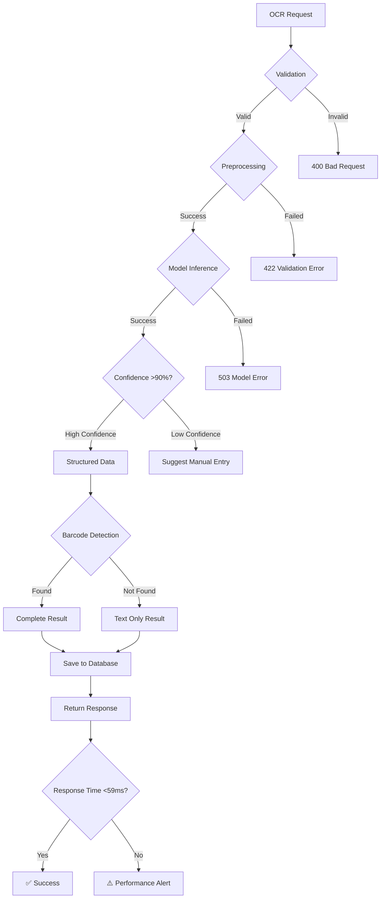

# OCR Processing Flow Sequence Diagram

```mermaid
sequenceDiagram
    participant M as Mobile App
    participant F as FastAPI Server
    participant R as Redis Queue
    participant P as Image Preprocessor
    participant O as OCR Engine
    participant S as Structured Data Extractor
    participant B as Barcode Detector
    participant D as Database
    participant K as Kafka

    %% Synchronous Flow (Primary)
    M->>F: POST /api/v1/ocr/process<br/>[Image + Options]
    activate F

    Note over F: Validate Request<br/>< 5ms
    F->>P: preprocess_image()
    activate P

    Note over P: Auto-rotate, crop, enhance<br/>< 10ms
    P-->>F: preprocessed_image
    deactivate P

    F->>O: extract_text()
    activate O

    Note over O: TrOCR Model Inference<br/>< 30ms
    O-->>F: raw_text + confidence
    deactivate O

    par
        F->>S: parse_structured_data()
        activate S

        Note over S: Extract product, price, etc.<br/>< 5ms
        S-->>F: structured_data
        deactivate S

        F->>B: detect_barcodes()
        activate B

        Note over B: OpenCV Barcode Detection<br/>< 5ms
        B-->>F: barcode_data
        deactivate B
    end

    F->>D: save_ocr_result()
    activate D

    Note over D: Store in PostgreSQL<br/>< 4ms
    D-->>F: result_id
    deactivate D

    F-->>M: 200 OK [OCR Result]
    deactivate F

    %% Background Processing
    F->>K: Publish ocr.completed event
    activate K

    Note over K: Notify Product Service<br/>Async
    K-->>F: Event published
    deactivate K

    %% Error Flow
    alt Model Fails
        O-->>F: ERROR: Low confidence
        F-->>M: 200 OK [Manual entry suggested]
    else Timeout
        F-->>M: 408 Timeout [Queue for retry]
        F->>R: Add to retry queue
    end

    %% Performance Notes
    Note over F,M: Total Response Time: <59ms
    Note over O: Critical Path: TrOCR Inference
    Note over P,O,S,B,D: Parallel Processing Where Possible
    Note over R,K: Async Events Don't Block Response
```

## Processing Flow Details

### Critical Path Analysis
The 59ms requirement means every millisecond counts:

1. **Request Validation (5ms)**: JWT auth, input validation, rate limiting
2. **Image Preprocessing (10ms)**: Format conversion, enhancement, region detection
3. **OCR Model Inference (30ms)**: TrOCR forward pass, text decoding
4. **Data Structuring (5ms)**: Field extraction, validation, confidence scoring
5. **Barcode Detection (5ms)**: OpenCV processing, format identification
6. **Database Save (4ms)**: Insert result, update indexes

### Optimization Strategies

#### GPU Acceleration
```python
# Use CUDA if available for 10x speedup
device = "cuda" if torch.cuda.is_available() else "cpu"
model = model.to(device)
# Batch processing multiple text regions simultaneously
```

#### Model Optimization
```python
# Use smaller, quantized models for speed
model = VisionEncoderDecoderModel.from_pretrained(
    'microsoft/trocr-small-printed',
    torch_dtype=torch.float16  # Half precision for speed
)
```

#### Caching Strategy
```python
# Cache model outputs and preprocessing results
@cache(ttl=3600)  # 1 hour cache
def get_ocr_result(image_hash: str):
    # Return cached result if available
    return cached_result
```

### Error Handling Flow



### Performance Monitoring Points

1. **Request Latency**: Track total request duration
2. **Model Inference Time**: Monitor TrOCR processing speed
3. **Queue Depth**: Monitor pending requests
4. **Cache Hit Rate**: Track caching effectiveness
5. **Error Rates**: Monitor failures by component
6. **Memory Usage**: Track GPU/CPU memory consumption

### Integration with Mobile App

```typescript
// Mobile app flow with offline support
const processImageWithOCR = async (imageUri: string) => {
  try {
    // Try online processing first
    const result = await OCRService.process({
      image: imageUri,
      type: 'product',
      priority: 'high'
    });

    // Auto-populate form fields
    updateFormFields(result.structured);

  } catch (error) {
    // Fallback to offline queue
    await OCRQueue.add(imageUri, { type: 'product' });
    showOfflineMessage();
  }
};
```

## Success Criteria

### Performance Benchmarks
- **P50 Response Time**: <30ms (median)
- **P95 Response Time**: <59ms (95th percentile)
- **P99 Response Time**: <100ms (99th percentile)
- **Throughput**: 1000+ requests/minute
- **Accuracy**: >90% on printed text, >95% on structured data

### Error Recovery
- **Automatic Retries**: 3 attempts with exponential backoff
- **Graceful Degradation**: Fallback to simpler models if needed
- **User Feedback**: Clear error messages with suggested actions
- **Monitoring**: Real-time alerts for performance degradation

This aggressive 59ms requirement will push the system to use:
- **GPU acceleration** for model inference
- **Batch processing** for multiple text regions
- **Advanced caching** for similar images
- **Optimized preprocessing** pipelines
- **Async I/O** throughout the stack

The result will be a blazingly fast OCR system that feels instant to users! ⚡
