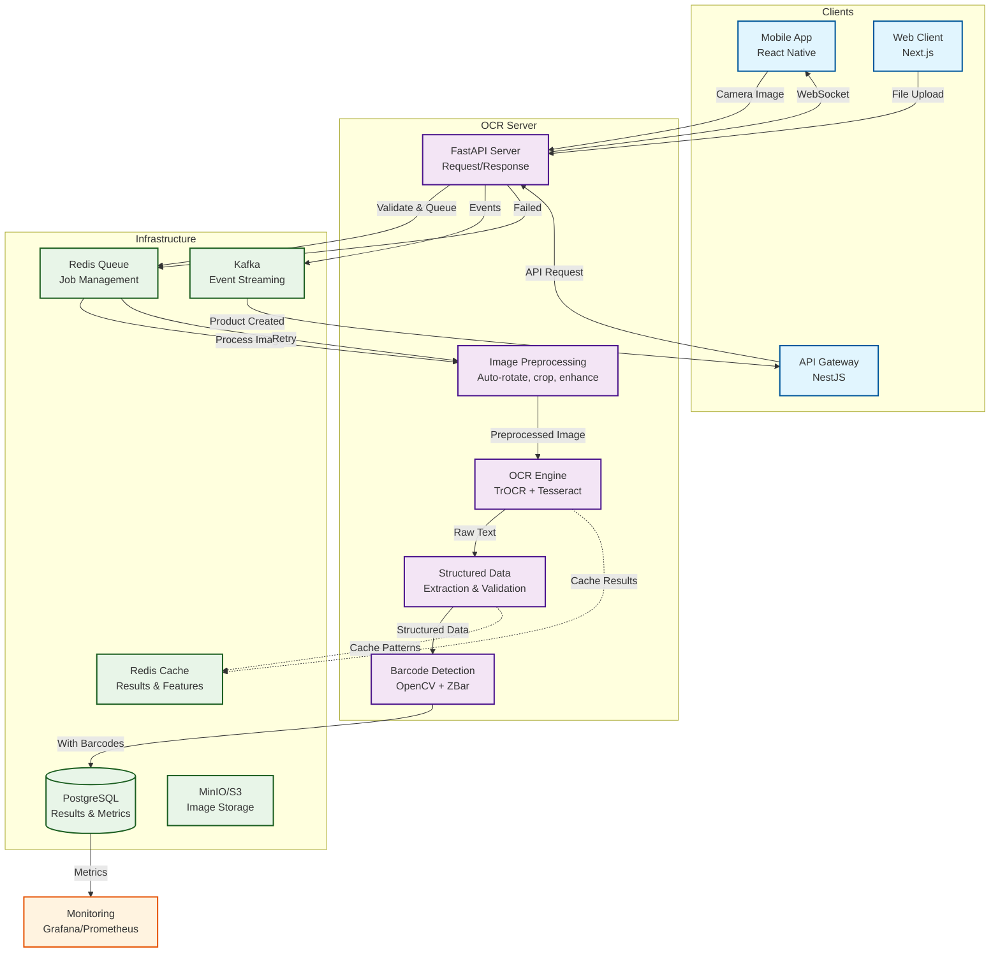

# OCR Server System Architecture

## Architecture Explanation

### Data Flow
1. **Client Request**: Mobile app or web client uploads image
2. **Preprocessing**: Image validation, format conversion, enhancement
3. **OCR Processing**: Text extraction using TrOCR/Tesseract
4. **Data Structuring**: Parse extracted text into product fields
5. **Barcode Detection**: Identify and decode barcodes/QR codes
6. **Storage & Caching**: Save results, cache for performance
7. **Event Publishing**: Notify other services of completion

### Performance Optimizations
- **GPU Acceleration**: CUDA support for faster model inference
- **Batch Processing**: Process multiple regions simultaneously
- **Model Quantization**: Optimized models for speed vs accuracy trade-off
- **Connection Pooling**: Efficient database and cache connections
- **Async Processing**: Non-blocking I/O operations throughout

### Integration Points
- **Mobile App**: Camera integration with real-time preview
- **Web Client**: Drag-and-drop upload with progress tracking
- **Product Service**: Auto-creation/update of products from OCR results
- **Inventory Service**: Bulk updates from invoice processing
- **Analytics**: Usage metrics and accuracy monitoring
