# Phase 0: Core POS Foundation - Flowchart Diagram

## High-Level Process Flow

This flowchart diagram represents the overall process and logic of the Phase 0 Core POS Foundation, showing decision points, data flows, and processing stages.

```mermaid
flowchart TD
    Start([User Starts POS System]) --> Auth{Authentication Required?}
    
    %% Authentication Flow
    Auth -->|Yes| Login[Login Process]
    Login --> OTP[Send OTP to Phone]
    OTP --> Verify[Verify OTP]
    Verify -->|Valid| DeviceReg[Register Device]
    Verify -->|Invalid| Login
    DeviceReg --> Token[Generate JWT Tokens]
    Token --> MainMenu[Main Menu]
    
    Auth -->|No| MainMenu
    
    %% Main Menu Options
    MainMenu --> Choice{Select Operation}
    
    %% Product Management Flow
    Choice -->|Product Mgmt| ProductMenu[Product Management]
    ProductMenu --> ProductChoice{Product Action}
    ProductChoice -->|Add Product| AddProduct[Add New Product]
    ProductChoice -->|Update Product| UpdateProduct[Update Product]
    ProductChoice -->|Add Barcode| AddBarcode[Add Barcode]
    ProductChoice -->|Bulk Import| BulkImport[Bulk Import Products]
    
    AddProduct --> ValidateProduct[Validate Product Data]
    ValidateProduct -->|Valid| SaveProduct[Save to Database]
    ValidateProduct -->|Invalid| ProductMenu
    SaveProduct --> ProductMenu
    
    UpdateProduct --> ValidateUpdate[Validate Update Data]
    ValidateUpdate -->|Valid| UpdateDB[Update Database]
    ValidateUpdate -->|Invalid| ProductMenu
    UpdateDB --> ProductMenu
    
    AddBarcode --> ValidateBarcode[Validate Barcode]
    ValidateBarcode -->|Valid| SaveBarcode[Save Barcode]
    ValidateBarcode -->|Invalid| ProductMenu
    SaveBarcode --> ProductMenu
    
    BulkImport --> ProcessCSV[Process CSV File]
    ProcessCSV --> ValidateBulk[Validate All Products]
    ValidateBulk -->|Valid| SaveBulk[Save All Products]
    ValidateBulk -->|Invalid| ProductMenu
    SaveBulk --> ProductMenu
    
    %% Inventory Management Flow
    Choice -->|Inventory Mgmt| InventoryMenu[Inventory Management]
    InventoryMenu --> InventoryChoice{Inventory Action}
    InventoryChoice -->|View Stock| ViewStock[View Current Stock]
    InventoryChoice -->|Adjust Stock| AdjustStock[Stock Adjustment]
    InventoryChoice -->|Transfer Stock| TransferStock[Stock Transfer]
    InventoryChoice -->|View Movements| ViewMovements[View Stock Movements]
    
    ViewStock --> DisplayStock[Display Stock Levels]
    DisplayStock --> InventoryMenu
    
    AdjustStock --> ValidateAdjustment[Validate Adjustment]
    ValidateAdjustment -->|Valid| ProcessAdjustment[Process Adjustment]
    ValidateAdjustment -->|Invalid| InventoryMenu
    ProcessAdjustment --> UpdateInventory[Update Inventory]
    UpdateInventory --> CreateMovement[Create Movement Record]
    CreateMovement --> InventoryMenu
    
    TransferStock --> ValidateTransfer[Validate Transfer]
    ValidateTransfer -->|Valid| ProcessTransfer[Process Transfer]
    ValidateTransfer -->|Invalid| InventoryMenu
    ProcessTransfer --> UpdateSource[Update Source Stock]
    UpdateSource --> UpdateDestination[Update Destination Stock]
    UpdateDestination --> CreateTransferMovement[Create Transfer Records]
    CreateTransferMovement --> InventoryMenu
    
    ViewMovements --> DisplayMovements[Display Movement History]
    DisplayMovements --> InventoryMenu
    
    %% Sales Transaction Flow
    Choice -->|New Sale| CreateCart[Create New Cart]
    CreateCart --> CartToken[Generate Cart Token]
    CartToken --> CartMenu[Cart Management]
    
    CartMenu --> CartChoice{Cart Action}
    CartChoice -->|Scan Product| ScanProduct[Scan Barcode]
    CartChoice -->|Manual Entry| ManualEntry[Manual Product Entry]
    CartChoice -->|View Cart| ViewCart[View Cart Contents]
    CartChoice -->|Checkout| Checkout[Proceed to Checkout]
    
    %% Product Scanning Flow
    ScanProduct --> DecodeBarcode[Decode Barcode]
    DecodeBarcode --> LookupProduct[Lookup Product in Database]
    LookupProduct -->|Found| CheckStock[Check Stock Availability]
    LookupProduct -->|Not Found| QuickAdd[Quick Add Product]
    
    CheckStock -->|In Stock| AddToCart[Add to Cart]
    CheckStock -->|Out of Stock| ShowError[Show Out of Stock Error]
    ShowError --> CartMenu
    
    QuickAdd --> ValidateQuickAdd[Validate Quick Add Data]
    ValidateQuickAdd -->|Valid| CreateProduct[Create Product]
    ValidateQuickAdd -->|Invalid| CartMenu
    CreateProduct --> AddToCart
    
    AddToCart --> CalculateTotals[Calculate Cart Totals]
    CalculateTotals --> UpdateCart[Update Cart in Redis]
    UpdateCart --> CartMenu
    
    %% Manual Entry Flow
    ManualEntry --> SearchProduct[Search Product]
    SearchProduct --> SelectProduct[Select Product]
    SelectProduct --> EnterQuantity[Enter Quantity]
    EnterQuantity --> ValidateQuantity[Validate Quantity]
    ValidateQuantity -->|Valid| AddToCart
    ValidateQuantity -->|Invalid| ManualEntry
    
    %% Cart Viewing
    ViewCart --> DisplayCart[Display Cart Contents]
    DisplayCart --> CartMenu
    
    %% Checkout Process
    Checkout --> ValidateCart[Validate Cart]
    ValidateCart -->|Valid| PaymentMethod[Select Payment Method]
    ValidateCart -->|Invalid| ShowCartError[Show Cart Error]
    ShowCartError --> CartMenu
    
    PaymentMethod --> ProcessPayment[Process Payment]
    ProcessPayment -->|Success| CreateSale[Create Sale Record]
    ProcessPayment -->|Failed| PaymentError[Show Payment Error]
    PaymentError --> PaymentMethod
    
    CreateSale --> UpdateInventory[Update Inventory]
    UpdateInventory --> GenerateReceipt[Generate Receipt]
    GenerateReceipt --> PrintReceipt[Print Receipt]
    PrintReceipt --> CompleteSale[Complete Sale]
    CompleteSale --> MainMenu
    
    %% Reporting Flow
    Choice -->|Reports| ReportMenu[Report Menu]
    ReportMenu --> ReportChoice{Report Type}
    ReportChoice -->|Sales Report| SalesReport[Generate Sales Report]
    ReportChoice -->|Inventory Report| InventoryReport[Generate Inventory Report]
    ReportChoice -->|Financial Report| FinancialReport[Generate Financial Report]
    
    SalesReport --> DisplaySales[Display Sales Data]
    DisplaySales --> ReportMenu
    
    InventoryReport --> DisplayInventory[Display Inventory Data]
    DisplayInventory --> ReportMenu
    
    FinancialReport --> DisplayFinancial[Display Financial Data]
    DisplayFinancial --> ReportMenu
    
    %% User Management Flow
    Choice -->|User Mgmt| UserMenu[User Management]
    UserMenu --> UserChoice{User Action}
    UserChoice -->|Add User| AddUser[Add New User]
    UserChoice -->|Update User| UpdateUser[Update User]
    UserChoice -->|Manage Roles| ManageRoles[Manage User Roles]
    
    AddUser --> ValidateUser[Validate User Data]
    ValidateUser -->|Valid| SaveUser[Save User]
    ValidateUser -->|Invalid| UserMenu
    SaveUser --> UserMenu
    
    UpdateUser --> ValidateUpdate[Validate Update Data]
    ValidateUpdate -->|Valid| UpdateUserDB[Update User]
    ValidateUpdate -->|Invalid| UserMenu
    UpdateUserDB --> UserMenu
    
    ManageRoles --> AssignRoles[Assign Roles & Permissions]
    AssignRoles --> UserMenu
    
    %% System Settings Flow
    Choice -->|Settings| SettingsMenu[System Settings]
    SettingsMenu --> SettingsChoice{Setting Type}
    SettingsChoice -->|General| GeneralSettings[General Settings]
    SettingsChoice -->|Tax| TaxSettings[Tax Settings]
    SettingsChoice -->|Printer| PrinterSettings[Printer Settings]
    
    GeneralSettings --> UpdateGeneral[Update General Settings]
    UpdateGeneral --> SettingsMenu
    
    TaxSettings --> UpdateTax[Update Tax Settings]
    UpdateTax --> SettingsMenu
    
    PrinterSettings --> UpdatePrinter[Update Printer Settings]
    UpdatePrinter --> SettingsMenu
    
    %% Logout Flow
    Choice -->|Logout| Logout[Logout Process]
    Logout --> RevokeSession[Revoke Session]
    RevokeSession --> ClearTokens[Clear Tokens]
    ClearTokens --> End([End Session])
    
    %% Error Handling
    Error[System Error] --> ErrorHandler[Error Handler]
    ErrorHandler --> LogError[Log Error]
    LogError --> ShowError[Show Error Message]
    ShowError --> MainMenu
    
    %% Styling
    classDef startEnd fill:#e1f5fe,stroke:#01579b,stroke-width:2px
    classDef process fill:#f3e5f5,stroke:#4a148c,stroke-width:2px
    classDef decision fill:#fff3e0,stroke:#e65100,stroke-width:2px
    classDef error fill:#ffebee,stroke:#c62828,stroke-width:2px
    classDef success fill:#e8f5e8,stroke:#2e7d32,stroke-width:2px
    
    class Start,End startEnd
    class Login,OTP,Verify,DeviceReg,Token,AddProduct,SaveProduct,CreateCart,AddToCart,CreateSale process
    class Auth,Choice,ProductChoice,InventoryChoice,CartChoice,ReportChoice,UserChoice,SettingsChoice decision
    class Error,ErrorHandler,LogError,ShowError error
    class CompleteSale,DisplaySales,DisplayInventory,DisplayFinancial success
```

## Key Process Flows

### 1. Authentication Flow
- OTP-based authentication
- Device registration
- JWT token management
- Session handling

### 2. Product Management Flow
- Product CRUD operations
- Barcode management
- Bulk import functionality
- Data validation

### 3. Inventory Management Flow
- Stock level tracking
- Stock adjustments
- Stock transfers
- Movement history

### 4. Sales Transaction Flow
- Cart creation and management
- Product scanning and entry
- Checkout process
- Payment processing
- Receipt generation

### 5. Reporting Flow
- Sales reports
- Inventory reports
- Financial reports
- Real-time dashboards

### 6. User Management Flow
- User creation and updates
- Role assignment
- Permission management

### 7. System Settings Flow
- General configuration
- Tax settings
- Printer configuration

## Error Handling

- Comprehensive error validation at each step
- User-friendly error messages
- Error logging and monitoring
- Graceful error recovery

## Performance Considerations

- Redis caching for cart operations
- Database optimization
- Real-time updates
- Efficient data processing
- Minimal API calls

## Security Features

- Authentication and authorization
- Data validation
- Input sanitization
- Audit logging
- Session management
