# Phase 0: Core POS Foundation - Sequence Diagram

## Complete End-to-End Workflow

This sequence diagram shows the complete workflow from user authentication through product scanning, cart management, checkout, and transaction completion.

```mermaid
sequenceDiagram
    participant U as User/Cashier
    participant M as Mobile POS App
    participant W as Web Backoffice
    participant A as API Server
    participant R as Redis Cache
    participant D as PostgreSQL DB
    participant P as Printer

    Note over U,P: Phase 0: Core POS Foundation - Complete Workflow

    %% Authentication Flow
    rect rgb(240, 248, 255)
        Note over U,P: 1. Authentication & Setup
        U->>M: Open Mobile POS App
        M->>A: POST /auth/otp/request
        A->>D: Store OTP request
        A-->>M: OTP sent to phone
        U->>M: Enter OTP
        M->>A: POST /auth/otp/verify
        A->>D: Validate OTP
        A->>D: Create session
        A-->>M: JWT tokens + user info
        M->>A: POST /devices/register
        A->>D: Register device
        A-->>M: Device registered
    end

    %% Product Management (Web)
    rect rgb(240, 255, 240)
        Note over U,P: 2. Product Setup (Web Backoffice)
        U->>W: Login to Web Backoffice
        W->>A: POST /auth/login
        A->>D: Validate credentials
        A-->>W: JWT tokens
        U->>W: Add Products
        W->>A: POST /products
        A->>D: Create product
        A-->>W: Product created
        U->>W: Add Barcodes
        W->>A: POST /products/{id}/barcodes
        A->>D: Create barcode
        A-->>W: Barcode added
    end

    %% Inventory Setup
    rect rgb(255, 248, 240)
        Note over U,P: 3. Inventory Setup
        U->>W: Set Initial Stock
        W->>A: POST /inventory/adjustments
        A->>D: Create inventory movement
        A->>D: Update stock levels
        A-->>W: Stock updated
    end

    %% Sales Transaction Flow
    rect rgb(255, 240, 255)
        Note over U,P: 4. Sales Transaction Flow
        U->>M: Start New Sale
        M->>A: POST /carts
        A->>R: Create cart in Redis
        A-->>M: Cart token
        
        loop Product Scanning
            U->>M: Scan Barcode
            M->>A: GET /products/barcode/{barcode}
            A->>D: Lookup product
            A->>D: Check stock availability
            A-->>M: Product details + stock
            
            alt Product Found & In Stock
                M->>A: POST /carts/{token}/lines
                A->>R: Add line to cart
                A->>A: Calculate totals + tax
                A-->>M: Updated cart + totals
            else Product Not Found
                M->>A: POST /products/quick-add
                A->>D: Create product
                A->>R: Add to cart
                A-->>M: Product created + added
            else Out of Stock
                A-->>M: Error: Out of stock
            end
        end
        
        U->>M: Review Cart
        M->>A: GET /carts/{token}
        A->>R: Get cart details
        A-->>M: Cart summary
    end

    %% Checkout Process
    rect rgb(255, 255, 240)
        Note over U,P: 5. Checkout & Payment
        U->>M: Proceed to Checkout
        M->>A: POST /carts/{token}/tender
        A->>A: Validate cart + stock
        A->>A: Calculate final totals
        A-->>M: Payment options
        
        U->>M: Select Payment Method (Cash)
        M->>A: POST /carts/{token}/commit
        A->>D: Begin transaction
        
        A->>D: Create sale record
        A->>D: Create sale lines
        A->>D: Update inventory (deduct stock)
        A->>D: Create payment record
        A->>D: Generate journal entries
        A->>D: Update customer ledger
        A->>D: Commit transaction
        
        A->>R: Clear cart
        A-->>M: Sale completed + receipt data
        
        M->>P: Print Receipt
        P-->>M: Receipt printed
    end

    %% Real-time Updates
    rect rgb(240, 240, 255)
        Note over U,P: 6. Real-time Updates
        A->>R: Publish inventory update
        R->>M: Broadcast stock change
        M->>M: Update local cache
        R->>W: Broadcast stock change
        W->>W: Update inventory display
    end

    %% Reporting
    rect rgb(248, 255, 248)
        Note over U,P: 7. Reporting & Analytics
        U->>W: View Sales Report
        W->>A: GET /reports/sales-daily
        A->>D: Query sales data
        A-->>W: Sales report data
        W->>W: Display charts + tables
        
        U->>W: View Inventory Report
        W->>A: GET /reports/inventory-summary
        A->>D: Query inventory data
        A-->>W: Inventory report data
        W->>W: Display stock levels
    end

    %% Error Handling
    rect rgb(255, 240, 240)
        Note over U,P: 8. Error Handling
        alt Network Error
            M->>M: Show offline message
            M->>M: Disable checkout
            M->>M: Show reconnect button
        else Stock Error
            A->>A: Validate stock before commit
            A-->>M: Error: Insufficient stock
            M->>M: Show error message
        else Payment Error
            A->>A: Validate payment
            A-->>M: Error: Payment failed
            M->>M: Retry payment
        end
    end

    %% Session Management
    rect rgb(248, 248, 255)
        Note over U,P: 9. Session Management
        A->>A: Check token expiry
        alt Token Expired
            A-->>M: 401 Unauthorized
            M->>A: POST /auth/token/refresh
            A->>D: Validate refresh token
            A-->>M: New access token
        end
        
        U->>M: Logout
        M->>A: POST /sessions/revoke
        A->>D: Invalidate session
        A-->>M: Logout successful
    end
```

## Key Features Demonstrated

1. **Authentication Flow**: OAuth 2.1/PKCE with JWT tokens
2. **Multi-Platform**: Mobile POS + Web Backoffice
3. **Real-time Inventory**: Live stock updates across devices
4. **Server-side Cart**: Redis-based cart management
5. **Transaction Processing**: Complete sale with accounting
6. **Receipt Printing**: Thermal printer integration
7. **Error Handling**: Comprehensive error scenarios
8. **Session Management**: Token refresh and logout
9. **Reporting**: Real-time dashboards and reports

## Error Scenarios Covered

- Network connectivity issues
- Stock availability problems
- Payment processing failures
- Token expiration handling
- Device registration errors
- Product lookup failures

## Performance Considerations

- Redis caching for cart operations
- Database connection pooling
- Real-time updates via Redis pub/sub
- Optimized database queries
- Efficient barcode lookup
- Minimal API calls for cart operations
