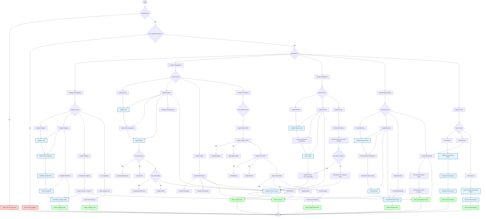

# Product Catalog Management - Flowchart

```mermaid
flowchart TD
    Start([Start]) --> AuthCheck{Authenticated?}

    AuthCheck -->|No| AuthFail[Return 401 Unauthorized]
    AuthCheck -->|Yes| PermissionCheck{Has Catalog Permissions?}

    PermissionCheck -->|No| PermFail[Return 403 Forbidden]
    PermissionCheck -->|Yes| ActionCheck{What Action?}

    ActionCheck --> Category[Category Management]
    ActionCheck --> Product[Product Management]
    ActionCheck --> Variant[Variant Management]
    ActionCheck --> Barcode[Barcode Management]
    ActionCheck --> Search[Search & Filter]

    %% Category Management
    Category --> CategoryAction{Category Action?}
    CategoryAction --> CreateCat[Create Category]
    CategoryAction --> UpdateCat[Update Category]
    CategoryAction --> DeleteCat[Delete Category]
    CategoryAction --> ListCat[List Categories]

    CreateCat --> ValidateCatInput[Validate Input]
    ValidateCatInput --> CheckParent[Check Parent Category]
    CheckParent --> BuildPath[Build Materialized Path]
    BuildPath --> SaveCategory[Save to Database]
    SaveCategory --> InvalidateCache[Invalidate Category Cache]
    InvalidateCache --> ReturnCat[Return Category Data]

    UpdateCat --> ValidateCatInput
    UpdateCat --> CheckParent
    UpdateCat --> RebuildPaths[Rebuild Child Paths]
    RebuildPaths --> SaveCategory
    RebuildPaths --> InvalidateCache

    DeleteCat --> SoftDelete[Soft Delete Category]
    SoftDelete --> MoveProducts[Move Products to Parent?]
    MoveProducts --> InvalidateCache
    MoveProducts --> ReturnSuccess[Return Success]

    ListCat --> GetTree[Build Category Tree]
    GetTree --> CacheTree[Cache Tree Structure]
    CacheTree --> ReturnTree[Return Category Tree]

    %% Product Management
    Product --> ProductAction{Product Action?}
    ProductAction --> CreateProd[Create Product]
    ProductAction --> UpdateProd[Update Product]
    ProductAction --> DeleteProd[Delete Product]
    ProductAction --> ListProd[List/Search Products]

    CreateProd --> ValidateProdInput[Validate Input]
    ValidateProdInput --> CheckSKU[Check SKU Uniqueness]
    CheckSKU --> SaveProduct[Save Product]
    SaveProduct --> CreateVariants{Create Variants?}
    CreateVariants -->|Yes| createVariantRecords
    CreateVariants -->|No| skipVariants
    CreateVariants --> createBarcodes{Create Barcodes?}
    createBarcodes -->|Yes| createBarcodeRecords
    createBarcodes -->|No| skipBarcodes
    createBarcodes --> InvalidateProdCache[Invalidate Product Cache]
    InvalidateProdCache --> ReturnProduct[Return Product Data]

    UpdateProd --> ValidateProdInput
    UpdateProd --> CheckSKU
    UpdateProd --> SaveProduct
    UpdateProd --> UpdateVariants[Update Existing Variants]
    UpdateProd --> InvalidateProdCache

    DeleteProd --> SoftDeleteProd[Soft Delete Product]
    SoftDeleteProd --> DisableVariants[Disable All Variants]
    SoftDeleteProd --> DisableBarcodes[Disable All Barcodes]
    SoftDeleteProd --> InvalidateProdCache
    SoftDeleteProd --> ReturnSuccess

    ListProd --> SearchQuery{Build Search Query}
    SearchQuery --> ApplyTenantFilter[Apply Tenant Filter]
    ApplyTenantFilter --> ApplyCategoryFilter[Apply Category Filter?]
    ApplyCategoryFilter -->|Yes| FilterByCategory
    ApplyCategoryFilter -->|No| SkipCategoryFilter
    ApplyCategoryFilter --> ApplyPriceFilter[Apply Price Filter?]
    ApplyPriceFilter -->|Yes| FilterByPrice
    ApplyPriceFilter -->|No| SkipPriceFilter
    ApplyPriceFilter --> ApplyStockFilter[Apply Stock Filter?]
    ApplyStockFilter -->|Yes| FilterByStock
    ApplyStockFilter -->|No| SkipStockFilter
    ApplyStockFilter --> ExecuteQuery[Execute Query]
    ExecuteQuery --> CacheResults[Cache Search Results]
    CacheResults --> ReturnResults[Return Paginated Results]

    %% Variant Management
    Variant --> VariantAction{Variant Action?}
    VariantAction --> CreateVar[Create Variant]
    VariantAction --> UpdateVar[Update Variant]
    VariantAction --> DeleteVar[Delete Variant]

    CreateVar --> ValidateVarInput[Validate Variant Input]
    ValidateVarInput --> CheckVarSKU[Check Variant SKU Uniqueness]
    CheckVarSKU --> SaveVariant[Save Variant]
    SaveVariant --> UpdateProductHasVariants[Update Product has_variants flag]
    UpdateProductHasVariants --> InvalidateProdCache
    InvalidateProdCache --> ReturnVariant[Return Variant Data]

    UpdateVar --> ValidateVarInput
    UpdateVar --> CheckVarSKU
    UpdateVar --> SaveVariant
    UpdateVar --> InvalidateProdCache

    DeleteVar --> SoftDeleteVar[Soft Delete Variant]
    SoftDeleteVar --> CheckRemainingVariants[Check if Product has other Variants]
    CheckRemainingVariants --> HasOthers{Has Other Variants?}
    HasOthers -->|Yes| UpdateProductHasVariants
    HasOthers -->|No| SetProductNoVariants[Set Product has_variants = false]
    SetProductNoVariants --> InvalidateProdCache
    InvalidateProdCache --> ReturnSuccess

    %% Barcode Management
    Barcode --> BarcodeAction{Barcode Action?}
    BarcodeAction --> CreateBC[Create Barcode]
    BarcodeAction --> UpdateBC[Update Barcode]
    BarcodeAction --> DeleteBC[Delete Barcode]
    BarcodeAction --> LookupBC[Lookup by Barcode]

    CreateBC --> ValidateBCInput[Validate Barcode Input]
    ValidateBCInput --> CheckBCDuplicate[Check Barcode Uniqueness]
    CheckBCDuplicate --> ValidateBCFormat[Validate Barcode Format]
    ValidateBCFormat --> SaveBarcode[Save Barcode]
    SaveBarcode --> InvalidateBCCache[Invalidate Barcode Cache]
    InvalidateBCCache --> ReturnBarcode[Return Barcode Data]

    UpdateBC --> ValidateBCInput
    UpdateBC --> CheckBCDuplicate
    UpdateBC --> SaveBarcode
    UpdateBC --> InvalidateBCCache

    DeleteBC --> SoftDeleteBC[Soft Delete Barcode]
    SoftDeleteBC --> InvalidateBCCache
    SoftDeleteBC --> ReturnSuccess

    LookupBC --> FastLookup[Fast Barcode Lookup Query]
    FastLookup --> LogScan[Log Barcode Scan for Analytics]
    LogScan --> ReturnProduct[Return Associated Product]

    %% Search Operations
    Search --> SearchType{Search Type?}
    SearchType --> TextSearch[Text Search]
    SearchType --> BarcodeScan[Barcode Scan]
    SearchType --> FilterSearch[Filter Search]

    TextSearch --> BuildTextQuery[Build Full-Text Search Query]
    BuildTextQuery --> ExecuteTextSearch[Execute Search Query]
    ExecuteTextSearch --> HighlightResults[Highlight Search Terms]
    HighlightResults --> ReturnSearchResults[Return Search Results]

    BarcodeScan --> LookupBC
    LookupBC --> ReturnProduct

    FilterSearch --> ApplyFilters[Apply Category/Price/Stock Filters]
    ApplyFilters --> ExecuteFilteredQuery[Execute Filtered Query]
    ExecuteFilteredQuery --> ReturnFilteredResults[Return Filtered Results]

    %% Error Handling
    AuthFail --> End([End])
    PermFail --> End
    ReturnCat --> End
    ReturnProduct --> End
    ReturnVariant --> End
    ReturnBarcode --> End
    ReturnTree --> End
    ReturnResults --> End
    ReturnSearchResults --> End
    ReturnFilteredResults --> End
    ReturnSuccess --> End

    %% Styling
    classDef errorClass fill:#ffcccc,stroke:#cc0000,stroke-width:2px
    classDef successClass fill:#ccffcc,stroke:#00cc00,stroke-width:2px
    classDef processClass fill:#e1f5fe,stroke:#01579b,stroke-width:2px

    class AuthFail,PermFail errorClass
    class ReturnCat,ReturnProduct,ReturnVariant,ReturnBarcode,ReturnTree,ReturnResults,ReturnSearchResults,ReturnFilteredResults,ReturnSuccess successClass
    class ValidateCatInput,ValidateProdInput,ValidateVarInput,ValidateBCInput,CheckParent,BuildPath,SaveCategory,SaveProduct,SaveVariant,SaveBarcode,InvalidateCache,InvalidateProdCache,InvalidateBCCache,BuildTextQuery,ExecuteTextSearch,HighlightResults,ApplyFilters,ExecuteFilteredQuery processClass
```

