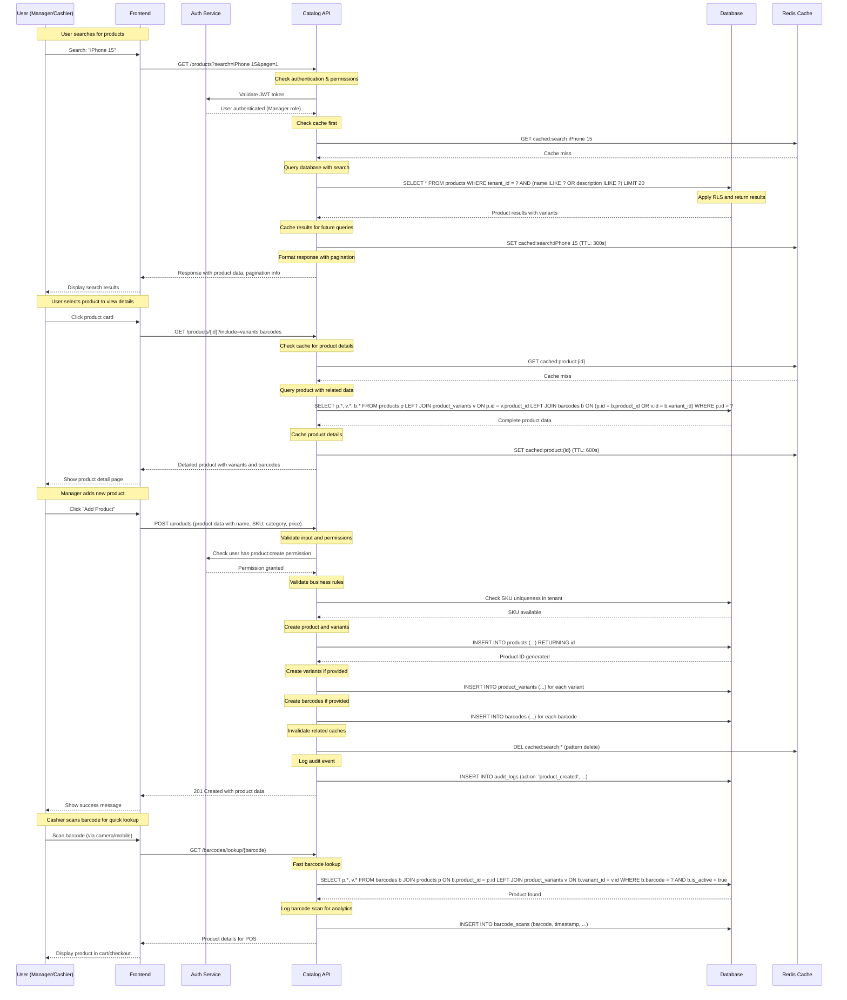

# Product Catalog Management - Sequence Diagram

```mermaid
sequenceDiagram
    participant U as User (Manager/Cashier)
    participant F as Frontend
    participant A as Auth Service
    participant C as Catalog API
    participant D as Database
    participant R as Redis Cache

    Note over U,F: User searches for products

    U->>F: Search: "iPhone 15"
    F->>C: GET /products?search=iPhone 15&page=1

    Note over C: Check authentication & permissions
    C->>A: Validate JWT token
    A-->>C: User authenticated (Manager role)

    Note over C: Check cache first
    C->>R: GET cached:search:iPhone 15
    R-->>C: Cache miss

    Note over C: Query database with search
    C->>D: SELECT * FROM products WHERE tenant_id = ? AND (name ILIKE ? OR description ILIKE ?) LIMIT 20

    Note over D: Apply RLS and return results
    D-->>C: Product results with variants

    Note over C: Cache results for future queries
    C->>R: SET cached:search:iPhone 15 (TTL: 300s)

    Note over C: Format response with pagination
    C-->>F: Response with product data, pagination info

    F-->>U: Display search results

    Note over U,F: User selects product to view details

    U->>F: Click product card
    F->>C: GET /products/{id}?include=variants,barcodes

    Note over C: Check cache for product details
    C->>R: GET cached:product:{id}
    R-->>C: Cache miss

    Note over C: Query product with related data
    C->>D: SELECT p.*, v.*, b.* FROM products p LEFT JOIN product_variants v ON p.id = v.product_id LEFT JOIN barcodes b ON (p.id = b.product_id OR v.id = b.variant_id) WHERE p.id = ?

    D-->>C: Complete product data

    Note over C: Cache product details
    C->>R: SET cached:product:{id} (TTL: 600s)

    C-->>F: Detailed product with variants and barcodes
    F-->>U: Show product detail page

    Note over U,F: Manager adds new product

    U->>F: Click "Add Product"
    F->>C: POST /products (product data with name, SKU, category, price)

    Note over C: Validate input and permissions
    C->>A: Check user has product:create permission
    A-->>C: Permission granted

    Note over C: Validate business rules
    C->>D: Check SKU uniqueness in tenant
    D-->>C: SKU available

    Note over C: Create product and variants
    C->>D: INSERT INTO products (...) RETURNING id
    D-->>C: Product ID generated

    Note over C: Create variants if provided
    C->>D: INSERT INTO product_variants (...) for each variant

    Note over C: Create barcodes if provided
    C->>D: INSERT INTO barcodes (...) for each barcode

    Note over C: Invalidate related caches
    C->>R: DEL cached:search:* (pattern delete)

    Note over C: Log audit event
    C->>D: INSERT INTO audit_logs (action: 'product_created', ...)

    C-->>F: 201 Created with product data
    F-->>U: Show success message

    Note over U,F: Cashier scans barcode for quick lookup

    U->>F: Scan barcode (via camera/mobile)
    F->>C: GET /barcodes/lookup/{barcode}

    Note over C: Fast barcode lookup
    C->>D: SELECT p.*, v.* FROM barcodes b JOIN products p ON b.product_id = p.id LEFT JOIN product_variants v ON b.variant_id = v.id WHERE b.barcode = ? AND b.is_active = true

    D-->>C: Product found

    Note over C: Log barcode scan for analytics
    C->>D: INSERT INTO barcode_scans (barcode, timestamp, ...)

    C-->>F: Product details for POS
    F-->>U: Display product in cart/checkout
```

