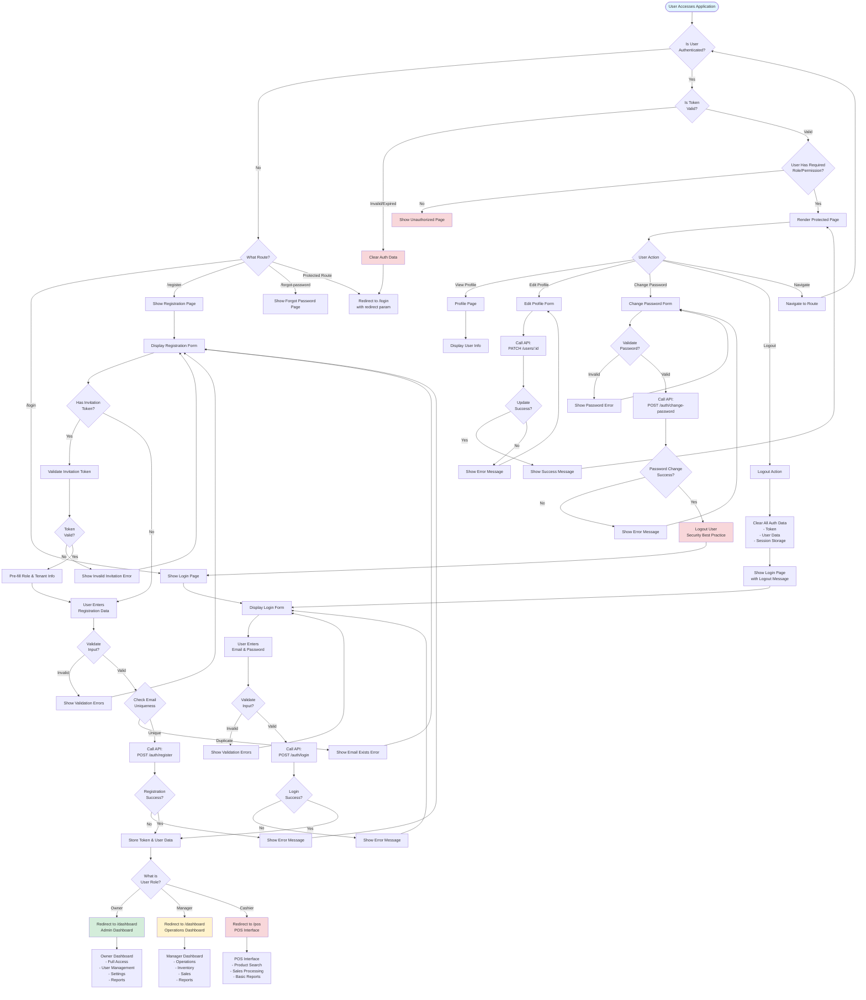
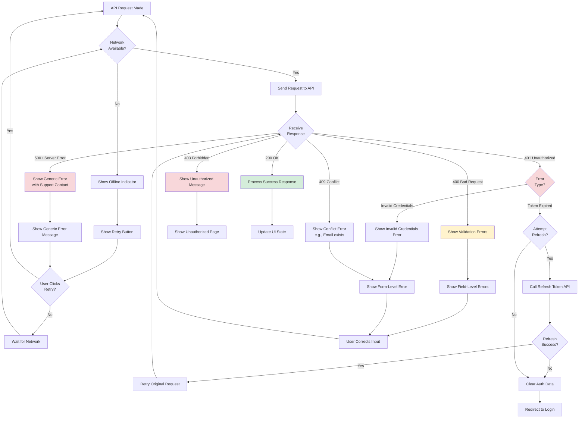
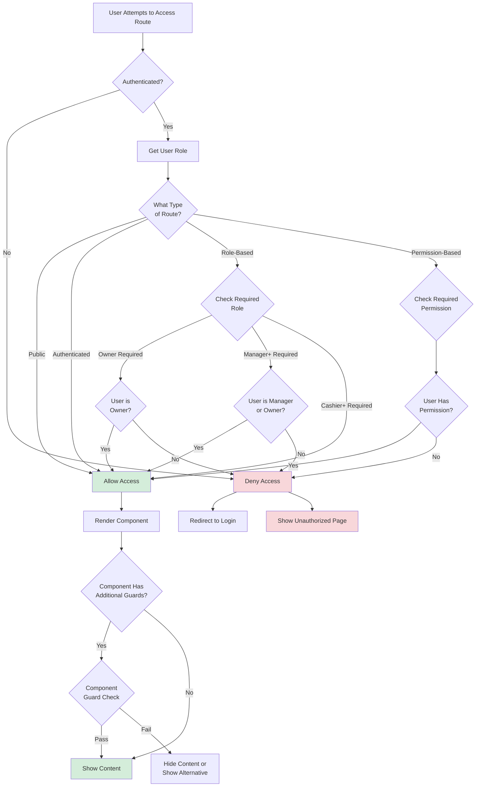

# Authentication Workflow - Flowchart

## Complete Authentication Decision Flow

```mermaid
flowchart TD
    Start([User Accesses Application]) --> CheckAuth{Is User<br/>Authenticated?}
    
    CheckAuth -->|No| CheckRoute{What Route?}
    CheckAuth -->|Yes| CheckToken{Is Token<br/>Valid?}
    
    CheckRoute -->|/login| ShowLogin[Show Login Page]
    CheckRoute -->|/register| ShowRegister[Show Registration Page]
    CheckRoute -->|/forgot-password| ShowForgotPassword[Show Forgot Password Page]
    CheckRoute -->|Protected Route| RedirectLogin[Redirect to /login<br/>with redirect param]
    
    ShowLogin --> LoginForm[Display Login Form]
    LoginForm --> UserInput[User Enters<br/>Email & Password]
    UserInput --> ValidateLogin{Validate<br/>Input?}
    
    ValidateLogin -->|Invalid| ShowLoginError[Show Validation Errors]
    ShowLoginError --> LoginForm
    
    ValidateLogin -->|Valid| CallLoginAPI[Call API:<br/>POST /auth/login]
    CallLoginAPI --> LoginResult{Login<br/>Success?}
    
    LoginResult -->|No| ShowLoginAPIError[Show Error Message]
    ShowLoginAPIError --> LoginForm
    
    LoginResult -->|Yes| StoreToken[Store Token & User Data]
    StoreToken --> CheckRole{What is<br/>User Role?}
    
    CheckRole -->|Owner| RedirectOwner[Redirect to /dashboard<br/>Admin Dashboard]
    CheckRole -->|Manager| RedirectManager[Redirect to /dashboard<br/>Operations Dashboard]
    CheckRole -->|Cashier| RedirectCashier[Redirect to /pos<br/>POS Interface]
    
    ShowRegister --> RegisterForm[Display Registration Form]
    RegisterForm --> CheckInvitation{Has Invitation<br/>Token?}
    
    CheckInvitation -->|Yes| ValidateInvitation[Validate Invitation Token]
    ValidateInvitation --> InvitationValid{Token<br/>Valid?}
    
    InvitationValid -->|No| ShowInvitationError[Show Invalid Invitation Error]
    ShowInvitationError --> RegisterForm
    
    InvitationValid -->|Yes| PrefillRole[Pre-fill Role & Tenant Info]
    PrefillRole --> UserRegisterInput[User Enters<br/>Registration Data]
    
    CheckInvitation -->|No| UserRegisterInput
    UserRegisterInput --> ValidateRegister{Validate<br/>Input?}
    
    ValidateRegister -->|Invalid| ShowRegisterError[Show Validation Errors]
    ShowRegisterError --> RegisterForm
    
    ValidateRegister -->|Valid| CheckEmailUnique{Check Email<br/>Uniqueness}
    CheckEmailUnique -->|Duplicate| ShowEmailError[Show Email Exists Error]
    ShowEmailError --> RegisterForm
    
    CheckEmailUnique -->|Unique| CallRegisterAPI[Call API:<br/>POST /auth/register]
    CallRegisterAPI --> RegisterResult{Registration<br/>Success?}
    
    RegisterResult -->|No| ShowRegisterAPIError[Show Error Message]
    ShowRegisterAPIError --> RegisterForm
    
    RegisterResult -->|Yes| StoreToken
    
    CheckToken -->|Invalid/Expired| ClearAuth[Clear Auth Data]
    ClearAuth --> RedirectLogin
    
    CheckToken -->|Valid| CheckPermissions{User Has Required<br/>Role/Permission?}
    
    CheckPermissions -->|No| ShowUnauthorized[Show Unauthorized Page]
    CheckPermissions -->|Yes| RenderPage[Render Protected Page]
    
    RedirectOwner --> DashboardOwner[Owner Dashboard<br/>- Full Access<br/>- User Management<br/>- Settings<br/>- Reports]
    
    RedirectManager --> DashboardManager[Manager Dashboard<br/>- Operations<br/>- Inventory<br/>- Sales<br/>- Reports]
    
    RedirectCashier --> POSInterface[POS Interface<br/>- Product Search<br/>- Sales Processing<br/>- Basic Reports]
    
    RenderPage --> CheckAction{User Action}
    
    CheckAction -->|View Profile| ProfilePage[Profile Page]
    CheckAction -->|Edit Profile| EditProfile[Edit Profile Form]
    CheckAction -->|Change Password| ChangePassword[Change Password Form]
    CheckAction -->|Logout| LogoutAction[Logout Action]
    CheckAction -->|Navigate| Navigation[Navigate to Route]
    
    ProfilePage --> ViewProfile[Display User Info]
    EditProfile --> UpdateProfile[Call API:<br/>PATCH /users/:id]
    UpdateProfile --> UpdateResult{Update<br/>Success?}
    
    UpdateResult -->|Yes| ShowSuccess[Show Success Message]
    UpdateResult -->|No| ShowUpdateError[Show Error Message]
    ShowUpdateError --> EditProfile
    
    ChangePassword --> ValidatePassword{Validate<br/>Password?}
    ValidatePassword -->|Invalid| ShowPasswordError[Show Password Error]
    ShowPasswordError --> ChangePassword
    
    ValidatePassword -->|Valid| CallPasswordAPI[Call API:<br/>POST /auth/change-password]
    CallPasswordAPI --> PasswordResult{Password Change<br/>Success?}
    
    PasswordResult -->|No| ShowPasswordAPIError[Show Error Message]
    ShowPasswordAPIError --> ChangePassword
    
    PasswordResult -->|Yes| LogoutAfterPassword[Logout User<br/>Security Best Practice]
    LogoutAfterPassword --> ShowLogin
    
    LogoutAction --> ClearAllAuth[Clear All Auth Data<br/>- Token<br/>- User Data<br/>- Session Storage]
    ClearAllAuth --> ShowLoginWithMessage[Show Login Page<br/>with Logout Message]
    
    Navigation --> CheckAuth
    
    ShowSuccess --> RenderPage
    ShowLoginWithMessage --> LoginForm
    
    style Start fill:#e1f5ff
    style RedirectOwner fill:#d4edda
    style RedirectManager fill:#fff3cd
    style RedirectCashier fill:#f8d7da
    style ShowUnauthorized fill:#f8d7da
    style ClearAuth fill:#f8d7da
    style LogoutAfterPassword fill:#f8d7da
```

## Error Handling Flow

```mermaid
flowchart TD
    APIRequest[API Request Made] --> NetworkCheck{Network<br/>Available?}
    
    NetworkCheck -->|No| ShowOffline[Show Offline Indicator]
    ShowOffline --> RetryButton[Show Retry Button]
    RetryButton --> UserRetry{User Clicks<br/>Retry?}
    UserRetry -->|Yes| APIRequest
    UserRetry -->|No| WaitForNetwork[Wait for Network]
    WaitForNetwork --> NetworkCheck
    
    NetworkCheck -->|Yes| SendRequest[Send Request to API]
    SendRequest --> ReceiveResponse{Receive<br/>Response}
    
    ReceiveResponse -->|200 OK| Success[Process Success Response]
    ReceiveResponse -->|400 Bad Request| ValidationError[Show Validation Errors]
    ReceiveResponse -->|401 Unauthorized| AuthError{Error<br/>Type?}
    ReceiveResponse -->|403 Forbidden| ForbiddenError[Show Unauthorized Message]
    ReceiveResponse -->|409 Conflict| ConflictError[Show Conflict Error<br/>e.g., Email exists]
    ReceiveResponse -->|500+ Server Error| ServerError[Show Generic Error<br/>with Support Contact]
    
    AuthError -->|Invalid Credentials| InvalidCreds[Show Invalid Credentials Error]
    AuthError -->|Token Expired| TokenExpired{Attempt<br/>Refresh?}
    
    TokenExpired -->|Yes| RefreshToken[Call Refresh Token API]
    RefreshToken --> RefreshResult{Refresh<br/>Success?}
    
    RefreshResult -->|Yes| RetryRequest[Retry Original Request]
    RetryRequest --> ReceiveResponse
    
    RefreshResult -->|No| ClearAuth[Clear Auth Data]
    ClearAuth --> RedirectLogin[Redirect to Login]
    
    TokenExpired -->|No| ClearAuth
    
    ValidationError --> ShowFieldErrors[Show Field-Level Errors]
    InvalidCreds --> ShowFormError[Show Form-Level Error]
    ConflictError --> ShowFormError
    ServerError --> ShowGenericError[Show Generic Error Message]
    ForbiddenError --> ShowUnauthorizedPage[Show Unauthorized Page]
    
    Success --> UpdateUI[Update UI State]
    ShowFieldErrors --> UserCorrection[User Corrects Input]
    ShowFormError --> UserCorrection
    ShowGenericError --> UserRetry
    
    UserCorrection --> APIRequest
    
    style Success fill:#d4edda
    style ValidationError fill:#fff3cd
    style AuthError fill:#f8d7da
    style ForbiddenError fill:#f8d7da
    style ServerError fill:#f8d7da
```

## Role-Based Access Control Flow

```mermaid
flowchart TD
    UserAccess[User Attempts to Access Route] --> CheckAuth{Authenticated?}
    
    CheckAuth -->|No| DenyAccess[Deny Access]
    DenyAccess --> RedirectLogin[Redirect to Login]
    
    CheckAuth -->|Yes| GetUserRole[Get User Role]
    GetUserRole --> RouteType{What Type<br/>of Route?}
    
    RouteType -->|Public| AllowAccess[Allow Access]
    RouteType -->|Authenticated| AllowAccess
    RouteType -->|Role-Based| CheckRole{Check Required<br/>Role}
    RouteType -->|Permission-Based| CheckPermission{Check Required<br/>Permission}
    
    CheckRole -->|Owner Required| IsOwner{User is<br/>Owner?}
    CheckRole -->|Manager+ Required| IsManager{User is Manager<br/>or Owner?}
    CheckRole -->|Cashier+ Required| AllowAccess
    
    IsOwner -->|Yes| AllowAccess
    IsOwner -->|No| DenyAccess
    
    IsManager -->|Yes| AllowAccess
    IsManager -->|No| DenyAccess
    
    CheckPermission --> HasPermission{User Has<br/>Permission?}
    HasPermission -->|Yes| AllowAccess
    HasPermission -->|No| DenyAccess
    
    AllowAccess --> RenderComponent[Render Component]
    DenyAccess --> ShowUnauthorized[Show Unauthorized Page]
    
    RenderComponent --> ComponentCheck{Component Has<br/>Additional Guards?}
    
    ComponentCheck -->|Yes| ComponentGuard{Component<br/>Guard Check}
    ComponentCheck -->|No| ShowContent[Show Content]
    
    ComponentGuard -->|Pass| ShowContent
    ComponentGuard -->|Fail| HideContent[Hide Content or<br/>Show Alternative]
    
    style AllowAccess fill:#d4edda
    style DenyAccess fill:#f8d7da
    style ShowUnauthorized fill:#f8d7da
    style ShowContent fill:#d4edda
```

